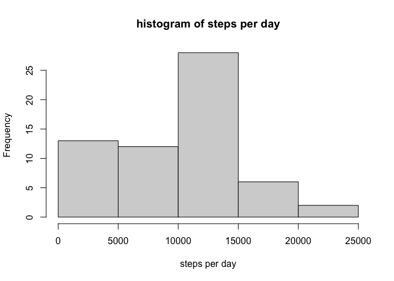
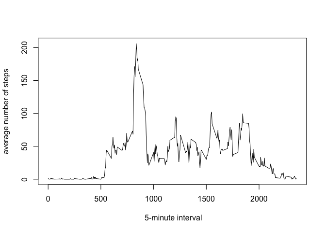
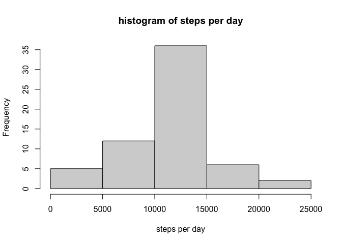
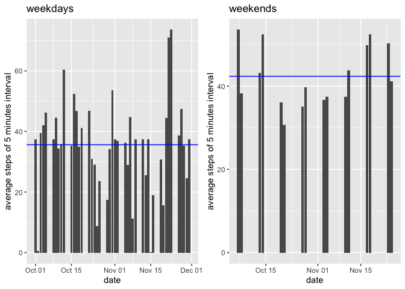

## 1. Loading and preprocessing the data


```r
library(readr)
# 1.1 Load the data
activity <- read_csv('./activity.csv')
```

```
## 
## ─ Column specification ────────────────────────────
## cols(
##   steps = col_double(),
##   date = col_date(format = ""),
##   interval = col_double()
## )
```

```r
dim(activity)
```

```
## [1] 17568     3
```

```r
head(activity)
```

```
## # A tibble: 6 x 3
##   steps date       interval
##   <dbl> <date>        <dbl>
## 1    NA 2012-10-01        0
## 2    NA 2012-10-01        5
## 3    NA 2012-10-01       10
## 4    NA 2012-10-01       15
## 5    NA 2012-10-01       20
## 6    NA 2012-10-01       25
```

```r
# 1.2 Process/transform the data (if necessary) into a format suitable for your analysis
# Transformation is done afterwards when needed 
```

## 2. What is mean total number of steps taken per day?


```r
library(dplyr)
```

```
## 
## Attaching package: 'dplyr'
```

```
## The following objects are masked from 'package:stats':
## 
##     filter, lag
```

```
## The following objects are masked from 'package:base':
## 
##     intersect, setdiff, setequal, union
```

```r
dateGroup <- group_by(activity, date)
summaryDateGroup <- summarise(dateGroup, steps=sum(steps, na.rm = TRUE))
# 2.1. Calculate the total number of steps taken per day
head(summaryDateGroup)
```

```
## # A tibble: 6 x 2
##   date       steps
##   <date>     <dbl>
## 1 2012-10-01     0
## 2 2012-10-02   126
## 3 2012-10-03 11352
## 4 2012-10-04 12116
## 5 2012-10-05 13294
## 6 2012-10-06 15420
```


```r
# 2.2 Make a histogram of the total number of steps taken each day
hist(summaryDateGroup$steps, xlab="steps per day", main="histogram of steps per day")
```

<!-- -->


```r
# 2.3 Calculate and report the mean and median of the total number of steps taken per day
stepsMean <- mean(summaryDateGroup$steps)
stepsMedian <- median(summaryDateGroup$steps)
```

* mean: 9354.2295082 steps per day
* median: 1.0395\times 10^{4} steps per day


## 3. What is the average daily activity pattern?


```r
intervalGroup <- group_by(activity, interval)
summaryIntervalGroup <- summarise(intervalGroup, steps=mean(steps, na.rm=TRUE))
# 3.1 Make a time series plot (i.e. \color{red}{\verb|type = "l"|}type = "l") of the 5-minute interval (x-axis) and the average number of steps taken, averaged across all days (y-axis)
plot(summaryIntervalGroup$interval, summaryIntervalGroup$steps, xlab=' 5-minute interval', ylab='average number of steps', type='l')
```

<!-- -->


```r
head(summaryIntervalGroup)
```

```
## # A tibble: 6 x 2
##   interval  steps
##      <dbl>  <dbl>
## 1        0 1.72  
## 2        5 0.340 
## 3       10 0.132 
## 4       15 0.151 
## 5       20 0.0755
## 6       25 2.09
```

```r
# 3.2 Which 5-minute interval, on average across all the days in the dataset, contains the maximum number of steps?
colMaxStepsInterval <- which.max(summaryIntervalGroup$steps)
```

* The 5-minute interval that contains  the maximum number of steps on average: 835

## 4. Imputing missing values


```r
# 4.1 Calculate and report the total number of missing values in the dataset (i.e. the total number of rows with \color{red}{\verb|NA|}NAs)
sum(is.na(activity$steps))
```

```
## [1] 2304
```


```r
# 4.2 Devise a strategy for filling in all of the missing values in the dataset. The strategy does not need to be sophisticated. For example, you could use the mean/median for that day, or the mean for that 5-minute interval, etc.
# 4.3 Create a new dataset that is equal to the original dataset but with the missing data filled in.
imputedActivity <- activity
for (i in 1:length(imputedActivity$steps)) {
  if (is.na(imputedActivity$steps[i])) {
    aveSteps <- summaryIntervalGroup$steps[summaryIntervalGroup$interval == imputedActivity$interval[i]]
    imputedActivity$steps[i] <- aveSteps
  }
}
```

We use the mean for that 5-minute interval across all days for missing values.


```r
# 4.4 Make a histogram of the total number of steps taken each day and Calculate and report the mean and median total number of steps taken per day. Do these values differ from the estimates from the first part of the assignment? What is the impact of imputing missing data on the estimates of the total daily number of steps?
imputedDateGroup <- group_by(imputedActivity, date)
summaryImputedDateGroup <- summarise(imputedDateGroup, steps=sum(steps))
hist(summaryImputedDateGroup$steps, xlab="steps per day", main="histogram of steps per day")
```

<!-- -->

```r
imputedStepsMean <- mean(summaryImputedDateGroup$steps)
imputedStepsMedian <- median(summaryImputedDateGroup$steps)
```

* mean: 1.0766189\times 10^{4} steps per day
* median: 1.0766189\times 10^{4} steps per day

The values are different. The imputed ones are larger since we approximate NAs by the averages so it introduces more steps in one day.

## 5. Are there differences in activity patterns between weekdays and weekends?


```r
library(lubridate)
```

```
## 
## Attaching package: 'lubridate'
```

```
## The following objects are masked from 'package:base':
## 
##     date, intersect, setdiff, union
```

```r
Sys.setlocale(category = "LC_ALL", locale = "en_US.UTF-8")
```

```
## [1] "en_US.UTF-8/en_US.UTF-8/en_US.UTF-8/C/en_US.UTF-8/zh_TW.UTF-8"
```

```r
imputedActivity$ludate <- ymd(imputedActivity$date)
# Levels: Sun < Mon < Tue < Wed < Thu < Fri < Sat
#         1
# 5.1 Create a new factor variable in the dataset with two levels – “weekday” and “weekend” indicating whether a given date is a weekday or weekend day.
imputedActivity$wday <- as.numeric(wday(imputedActivity$ludate))
imputedActivity$isweekday <- ifelse(imputedActivity$wday  == 1 | imputedActivity$wday == 7, 0, 1)
imputedActivity$weekday <- factor(imputedActivity$isweekday, levels=c(1,0), labels = c('weekday', 'weekend'))
head(imputedActivity)
```

```
## # A tibble: 6 x 7
##    steps date       interval ludate      wday isweekday weekday
##    <dbl> <date>        <dbl> <date>     <dbl>     <dbl> <fct>  
## 1 1.72   2012-10-01        0 2012-10-01     2         1 weekday
## 2 0.340  2012-10-01        5 2012-10-01     2         1 weekday
## 3 0.132  2012-10-01       10 2012-10-01     2         1 weekday
## 4 0.151  2012-10-01       15 2012-10-01     2         1 weekday
## 5 0.0755 2012-10-01       20 2012-10-01     2         1 weekday
## 6 2.09   2012-10-01       25 2012-10-01     2         1 weekday
```

```r
table(imputedActivity$weekday)
```

```
## 
## weekday weekend 
##   12960    4608
```

```r
weekDayWeekendsGroup <- group_by(imputedActivity, weekday)
summaryWeekDayWeekendsGroup <- summarise(weekDayWeekendsGroup, steps=mean(steps))
averageWeekends <- summaryWeekDayWeekendsGroup$steps[summaryWeekDayWeekendsGroup$weekday == "weekend"]
averageWeekdays <- summaryWeekDayWeekendsGroup$steps[summaryWeekDayWeekendsGroup$weekday == "weekday"]
```

Average number of steps taken per 5-minute interval

* weekdays: 35.6105812
* weekends: 42.3664013


```r
# 5.2 Make a panel plot containing a time series plot (i.e. \color{red}{\verb|type = "l"|}type = "l") of the 5-minute interval (x-axis) and the average number of steps taken, averaged across all weekday days or weekend days (y-axis).
library(ggplot2)
library(gridExtra)
```

```
## 
## Attaching package: 'gridExtra'
```

```
## The following object is masked from 'package:dplyr':
## 
##     combine
```

```r
weekdays <- imputedActivity[imputedActivity$weekday == 'weekday',]
weekends <- imputedActivity[imputedActivity$weekday == 'weekend',]
g1 <- ggplot(weekdays, aes(x=date, y=steps/288)) +
     geom_bar(stat='identity') +
     geom_hline(yintercept = averageWeekdays, col='blue') +
     ggtitle("weekdays") +
     ylab("average steps of 5 minutes interval")
g2 <- ggplot(weekends, aes(x=date, y=steps/288)) +
     geom_bar(stat='identity') +
     geom_hline(yintercept = averageWeekends, col='blue') +
     ggtitle("weekends") +
      ylab("average steps of 5 minutes interval")
grid.arrange(g1, g2, ncol=2)
```

<!-- -->

* Note that from data, we have 288 5-minutes intervals per day so we taking average by dividing 288.
* We observe that we take more steps on weekends than weekdays.


